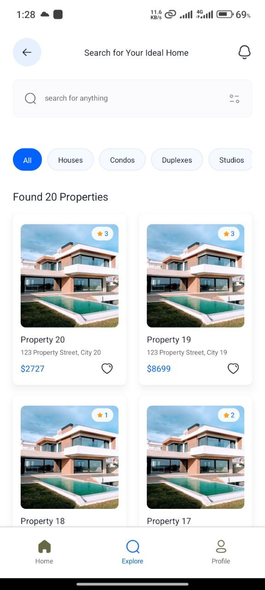
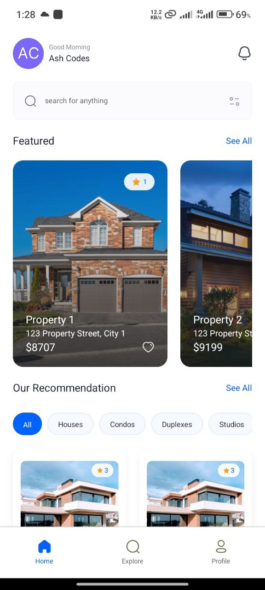

# Real Estate Mobile App

A modern real estate mobile application built with React Native, Expo, and Appwrite. This app allows users to browse properties, view detailed listings, and manage their real estate preferences.

## 🌟 Features

- **Authentication**: Google OAuth integration with Appwrite
- **Property Listings**: Browse through various types of properties
- **Search & Filters**: Search properties and filter by type
- **Property Details**: View detailed information about properties including:
  - Images and galleries
  - Amenities and facilities
  - Location information
  - Reviews and ratings
- **User Profiles**: Manage user profiles with customizable avatars
- **Responsive Design**: Built with NativeWind (Tailwind CSS for React Native)
- **Type Safety**: Written in TypeScript for better development experience

## 🛠️ Technologies

- [Expo](https://expo.dev/)
- [React Native](https://reactnative.dev/)
- [Appwrite](https://appwrite.io/)
- [NativeWind](https://www.nativewind.dev/)
- [TypeScript](https://www.typescriptlang.org/)
- [Expo Router](https://docs.expo.dev/router/introduction/)

## 📱 Screenshots





## 🚀 Getting Started

### Prerequisites

- Node.js (v14 or higher)
- npm or yarn
- Expo CLI
- Appwrite instance

### Environment Variables

Create a `.env` file in the root directory with the following variables:

```
EXPO_PUBLIC_APPWRITE_ENDPOINT=your_appwrite_endpoint
EXPO_PUBLIC_APPWRITE_PROJECT_ID=your_project_id
EXPO_PUBLIC_DATABASE_ID=your_database_id
EXPO_PUBLIC_APPWRITE_AGENTS_COLLECTION_ID=your_agents_collection_id
EXPO_PUBLIC_APPWRITE_GALLERIES_COLLECTION_ID=your_galleries_collection_id
EXPO_PUBLIC_APPWRITE_PROPERTIES_COLLECTION_ID=your_properties_collection_id
EXPO_PUBLIC_APPWRITE_REVIEWS_COLLECTION_ID=your_reviews_collection_id
EXPO_PUBLIC_APPWRITE_AVATARS_BUCKET_ID=your_avatars_bucket_id
```

### Installation

1. Clone the repository

```bash
git clone https://github.com/shahinheidary/StateNative.git
```

2. Install dependencies

```bash
npm install
```

3. Start the app

```bash
npx expo start
```

### Running the App

- For iOS: Press `i` in the terminal or run `npm run ios`
- For Android: Press `a` in the terminal or run `npm run android`
- For web: Press `w` in the terminal or run `npm run web`

## 📁 Project Structure

```
├── app/ # Main application code
│ ├── (root)/ # Protected routes
│ ├── layout.tsx # Root layout component
│ └── sign-in.tsx # Authentication screen
├── components/ # Reusable components
├── constants/ # App constants and assets
├── lib/ # Utility functions and hooks
└── assets/ # Static assets
```

## 🤝 Contributing

1. Fork the repository
2. Create your feature branch (`git checkout -b feature/AmazingFeature`)
3. Commit your changes (`git commit -m 'Add some AmazingFeature'`)
4. Push to the branch (`git push origin feature/AmazingFeature`)
5. Open a Pull Request

## 📄 License

This project is licensed under the MIT License - see the [LICENSE](LICENSE) file for details

## 👏 Acknowledgments

- [Expo](https://expo.dev/) for the amazing development platform
- [Appwrite](https://appwrite.io/) for the backend services
- [NativeWind](https://www.nativewind.dev/) for the styling solution

## 📧 Contact

Project Link: [https://github.com/shahinheidary/StateNative](https://github.com/shahinheidary/StateNative)
